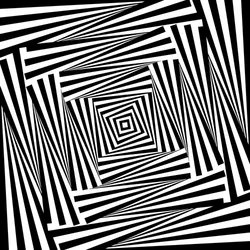
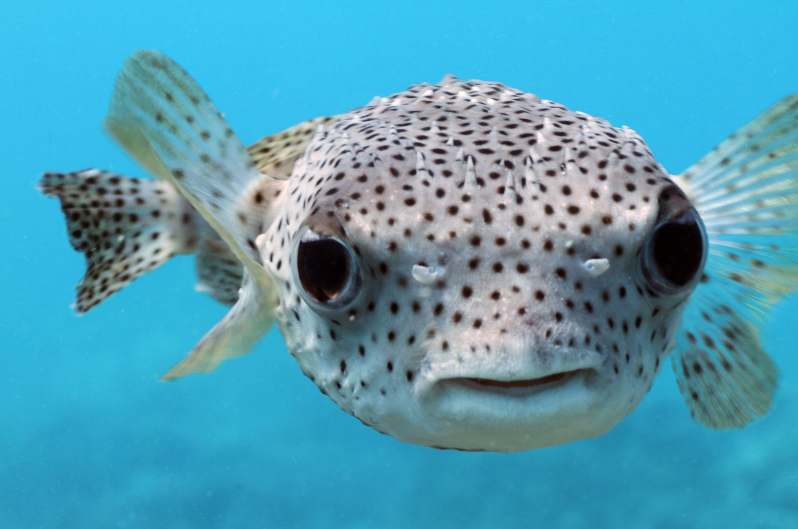
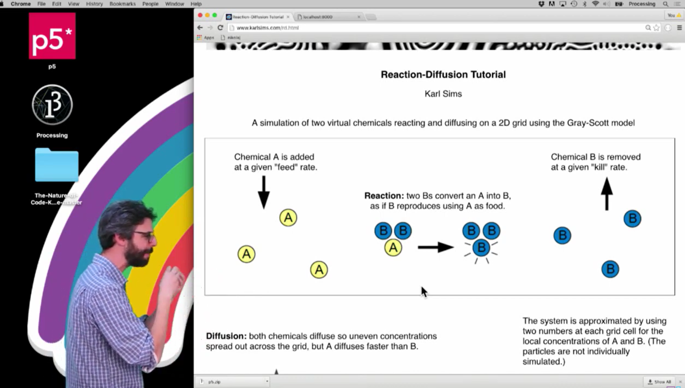

# Quiz 9

## Part 1: Imaging Technique Inspiration

### Reaction-Diffusion Patterns (Turing Patterns)

In 1952, Alan Turing proposed reaction-diffusion systems, a technique that simulates how two virtual chemical substances interact and diffuse on a surface, creating organic, ever-evolving textures. These textures evoke a sense of change and mystery. Similar patterns exist in nature, such as animal skin, coral, and the growth of organisms. What attracts me most about this technique is its regularity and complexity. It uses only the simplest geometric shapes to create mysterious images. These regular geometric patterns are well-suited for code control.

---

**Example 1 — Animated Turing Pattern Simulation**

*Reaction-diffusion*

---

**Example 2 — Natural Turing Patterns on Pufferfish Skin**

*Pufferfish skin*

---

## Part 2: Coding Technique Exploration ##

### Pixel Array Manipulation in p5.js ###

The reaction-diffusion simulation works by accessing every pixel on the canvas each frame and applying the Gray-Scott equations. In p5.js, this is primarily implemented using the loadPixels() and updatePixels() functions, which directly read and write each pixel on the canvas. A new color is calculated based on these values ​​and then written to it. This process is repeated frame by frame, causing the image to continuously change as if it's growing, similar to the idea of ​​nested loops.

---

**Coding Technique**

*Coding Challenge #13: Reaction Diffusion Algorithm in p5.js*

---

**Example Implementation**

- **Video walkthrough:** [Coding Challenge #13 — Reaction Diffusion in p5.js](https://www.youtube.com/watch?v=BV9ny785UNc) — Daniel Shiffman, The Coding Train
- **p5.js reference — loadPixels() :** [p5js.org/reference/p5/loadPixels](https://p5js.org/reference/p5/loadPixels/)
